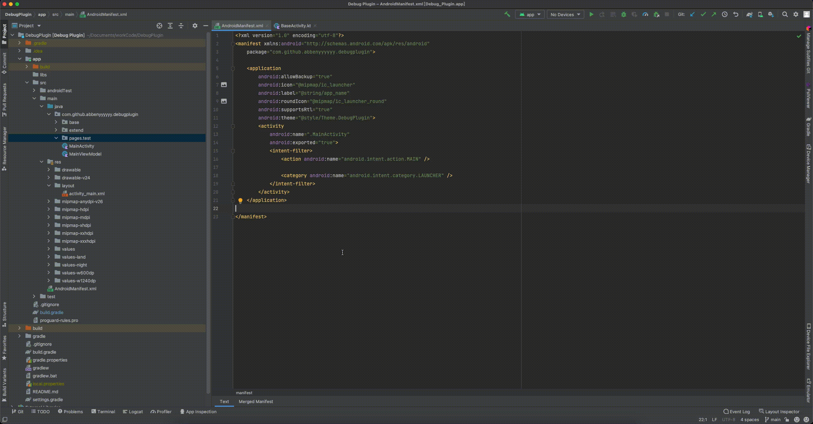

    

### 简介
<!-- Plugin description -->
#### 这是一个 IntelliJ IDEA 插件，可帮助您快速创建 Activity 模版。

- 创建 Activity 、layout 布局文件和 viewModel,并将 Activity 自动注册到清单文件

<!-- Plugin description end -->

### 效果演示

### 编译与调试

该插件基于 [IntelliJ 平台插件模板](https://github.com/JetBrains/intellij-platform-plugin-template) 开发,若想了解更多,可以阅读其文档.

1. 克隆该项目;
2. 使用 IntelliJ IDEA 社区版打开;
3. 调试
  - 打开右侧 gradle 工具窗口,点击 `intelliJ -> runIde` 执行调试
  - 或者执行命令 `./gradlew runIde` 执行调试
4. 编译
  - 打开右侧 gradle 工具窗口,点击 `intelliJ -> buildPlugin` 执行编译
  - 或者执行命令 `./gradlew buildPlugin` 执行编译
5. 编译完成后在 `./build/distributions` 目录下生成插件安装包

配合快速调试的 [Android 项目](https://github.com/abbenyyyyyy/DebugAndroidPlugin) 。

### 参考

[IDEA 插件开发官方指南](https://plugins.jetbrains.com/docs/intellij/welcome.html)

[Java swing 布局与控件官方教程](https://docs.oracle.com/javase/tutorial/uiswing/layout/index.html)

[IntelliJ 在 Android Studio 的 Android 插件代码仓库](https://github.com/JetBrains/android)
